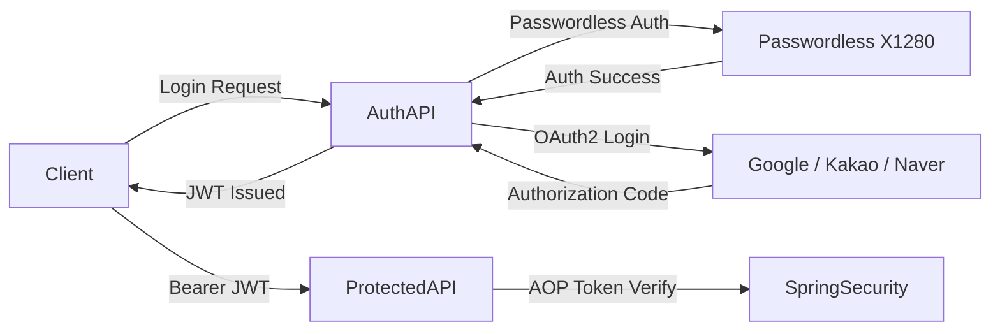

# EVLink API Specification

EVLink는 전기차 충전 공유 플랫폼으로,  
**Passwordless 인증 + OAuth2 소셜 로그인**을 기반으로  
**Spring Security & JWT 기반 인증 구조**를 사용합니다.

---

## 🔐 Authentication & Authorization Flow

본 시스템은 비밀번호 없는 인증(Passwordless)과  
OAuth2 소셜 로그인을 모두 지원하며,  
모든 보호 API는 JWT 토큰 기반으로 접근 제어됩니다.

---

## 1. Authentication Architecture Overview




## 2. Login Methods

### 2.1 Passwordless Login (X1280)

- 사용자 회원가입 요청  
- Passwordless X1280 서버에 사용자 등록  
- 모바일 App에서 QR 코드 인식  
- 인증 성공 시 서버 콜백  
- Spring Security 인증 객체 수동 설정  
- JWT Access Token 발급  

### 2.2 OAuth2 Social Login

- Client → SNS 로그인 URL 요청  
- 사용자 SNS 로그인  
- Authorization Code 반환  
- Spring Security OAuth2 Client 처리  
- 사용자 프로필 매핑  
- JWT Access Token 발급  


## 3. JWT Token Policy

```http
Authorization: Bearer {AccessToken}

```

## 4. Authorization (Role-Based Access)

### 4.1 USER_ROLE

ROLE_USER
- 충전소 조회
- 예약 / 결제
- 커뮤니티
- AI 게시판
- 
### 4.2 ADMIN_ROLE 

ROLE_ADMIN
- 관리자 대시보드
- 사용자 관리
- 콘텐츠 관리
- 얼굴 인식 기반 접근 제어


## 5. Secured API Request Flow
```
sequenceDiagram
    participant Client
    participant API
    participant Security

    Client->>API: Request (JWT)
    API->>Security: Token Validation (AOP)
    Security-->>API: 인증 성공
    API-->>Client: 200 OK + Response Data

```

